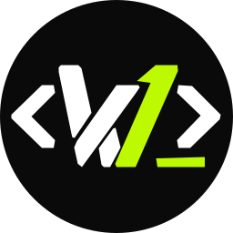

<div align="center">
  
  <h1>W1N PROJECT</h1>
  <p>Generate a tested, production-oriented web or mobile project with stack-specific code, CI, deployment artifacts, documentation, and agent guidance.</p>
</div>

## Start

```bash
npx create-win-project@latest
```

Answer product questions, choose whether dependencies should be installed, then follow the generated project README. Existing non-empty destinations are never overwritten.

```text
my-project/
├── application source and tests
├── .github/workflows/       CI and security checks
├── Dockerfile / eas.json    production artifacts when applicable
├── AGENTS.md                small agent operating contract
├── RULES.md                 task-to-playbook router
├── CONTEXT.md               product decisions and approved deviations
├── playbooks/               selected stack guidance
└── create-win-project.profile.json
```

## Supported stacks

| Application | Backends and data |
|---|---|
| Next.js | None, Supabase, PostgreSQL, Spring Boot, Laravel, FastAPI |
| React + Vite | None, Supabase, Spring Boot, Laravel, FastAPI |
| Expo / React Native | None, Supabase, Spring Boot, Laravel, FastAPI |
| Laravel UI | Blade, Livewire, or Inertia React with Laravel |
| API only | Spring Boot, Laravel, or FastAPI |

Authentication follows the chosen stack and audience: Supabase Auth, server sessions, Sanctum SPA, or OIDC validation where supported.

## Production-oriented by default

Version 2 generates stack-appropriate tests, CI and security checks, production builds, environment guidance, operations documentation, and cloud-neutral deployment artifacts. Web tests include Playwright; Expo uses Jest and React Native Testing Library.

Optional complexity remains requirement-driven:

- Private object-storage uploads appear only when uploads are required.
- Durable queue conventions appear only when background jobs are required.
- Offline cache or synchronization appears only for mobile when selected.
- Development Docker and Make remain optional.

The baseline is not a substitute for product authorization, infrastructure sizing, compliance, secrets, monitoring, deployment approval, backups, or restore drills. See the [production contract](./docs/production-contract.md).

## Agent-flexible defaults

Agents may propose different architecture, providers, authentication, data boundaries, or major dependencies, but must obtain approval and record the decision in `CONTEXT.md` before changing them.

Exact tested direct versions come from dated profiles. Package managers resolve transitive dependencies and create project-owned lockfiles. Existing projects can run a read-only comparison:

```bash
create-win-project upgrade-report .
```

## Documentation

- [Documentation map](./docs/README.md)
- [Getting started](./docs/getting-started.md)
- [Production contract](./docs/production-contract.md)
- [Stacks and capabilities](./docs/capabilities.md)
- [Understanding a generated project](./docs/generated-project.md)
- [Compatibility and upgrades](./docs/compatibility.md)
- [Migrating from version 1](./docs/migration-v2.md)

## Development

```bash
git clone https://github.com/itsw1n/create-win-project
cd create-win-project
npm ci
npm test
```

See the [maintainer documentation](./docs/maintainers/contributing.md) before changing manifests, generated behavior, compatibility profiles, or CI.

## License

Licensed under the [MIT License](./LICENSE). Copyright © 2026 itsw1n.
