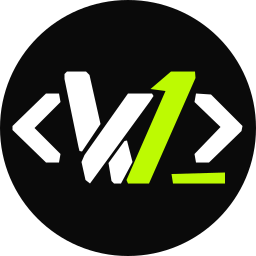

<div align="center">
  
  <h1>W1N PROJECT</h1>
  <p>Generate a stack-specific architecture scaffold or a runnable web, mobile, or backend project.</p>
</div>

> **Just answer what tech stack you want.** create-win-project turns your answers into a runnable, tested, agent-ready foundation

## Start

```bash
npx create-win-project@latest
```

Choose an Architecture Scaffold or Full Project, answer the stack questions, then follow the generated README. Architecture Scaffold creates Medium planning folders and a concise `ARCHITECTURE.md` without runnable code. Full Project asks about testing, CI, Docker, Makefile, agent guidance, and optional dependency installation. Existing non-empty destinations are never overwritten.

For example, a Full Next.js + FastAPI project using the Medium architecture profile with Docker, CI, and full guidance selected has this
feature-oriented shape:

```text
sample-project/
├── src/
│   ├── app/                         Next.js routes and entry points
│   └── features/status/
│       ├── components/
│       ├── services/
│       └── types.ts
├── backend/
│   ├── app/
│   │   ├── core/                    shared backend infrastructure
│   │   └── features/status/
│   │       ├── router.py
│   │       ├── service.py
│   │       ├── repository.py
│   │       └── schemas.py
│   └── tests/
├── .github/workflows/             CI and security checks
├── Dockerfile                     production frontend image
├── docs/                          project-specific guides
├── playbooks/                     selected stack guidance
├── AGENTS.md                      small agent operating contract
├── RULES.md                       task-to-playbook router
├── CONTEXT.md                     product decisions and deviations
└── create-win-project.profile.json
```

The exact folders change with the selected stack and Small, Medium, or Large architecture
profile. See [Understanding a generated project](./docs/generated-project.md).

## Supported stacks

| Application         | Backends and data                                         |
| ------------------- | --------------------------------------------------------- |
| Next.js             | None, Supabase, PostgreSQL, Spring Boot, Laravel, FastAPI |
| React + Vite        | None, Supabase, Spring Boot, Laravel, FastAPI             |
| Expo / React Native | None, Supabase, Spring Boot, Laravel, FastAPI             |
| Laravel UI          | Blade, Livewire, or Inertia React with Laravel            |
| API only            | Spring Boot, Laravel, or FastAPI                          |

Authentication follows the chosen stack and audience: Supabase Auth, server sessions, Sanctum SPA, or OIDC validation where supported.

## Production-oriented by default

Full projects generate stack-appropriate tests, production builds, environment guidance, and operations documentation. CI, browser tests, Docker artifacts, and agent guidance follow the interview choices. Expo uses Jest and React Native Testing Library when tests are selected.

Optional complexity remains requirement-driven:

- Private object-storage uploads appear only when uploads are required.
- Durable queue conventions appear only when background jobs are required.
- Offline cache or synchronization appears only for mobile when selected.
- Docker and Make remain optional; declining Docker omits both development and production container files.

The baseline is not a substitute for product authorization, infrastructure sizing, compliance, secrets, monitoring, deployment approval, backups, or restore drills. See the [production contract](./docs/production-contract.md).

## Agent-flexible defaults

Agents may propose different architecture, providers, authentication, data boundaries, or major dependencies, but must obtain approval and record the decision in `CONTEXT.md` before changing them.

Exact tested direct versions come from dated profiles. Package managers resolve transitive dependencies and create project-owned lockfiles. Existing projects can run a read-only comparison:

```bash
create-win-project upgrade-report .
```

## Documentation

- [Documentation map](./docs/README.md)
- [Getting started](./docs/getting-started.md)
- [Production contract](./docs/production-contract.md)
- [Stacks and capabilities](./docs/capabilities.md)
- [Understanding a generated project](./docs/generated-project.md)
- [Compatibility and upgrades](./docs/compatibility.md)
- [Migrating from version 1](./docs/migration-v2.md)

## Development

```bash
git clone https://github.com/itsw1n/create-win-project
cd create-win-project
npm ci
npm test
```

See the [maintainer documentation](./docs/maintainers/contributing.md) before changing manifests, generated behavior, compatibility profiles, or CI.

## License

Licensed under the [MIT License](./LICENSE). Copyright © 2026 itsw1n.
